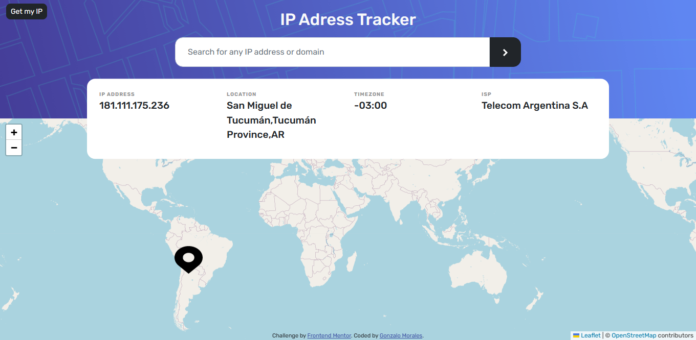

# Frontend Mentor - Advice Generator app solution

This is a solution to the [IP Adress Tracker App Challenge by FrontEndMentor](https://www.frontendmentor.io/challenges/ip-address-tracker-I8-0yYAH0). Frontend Mentor challenges help you improve your coding skills by building realistic projects.

## How To Use
Create a file called "API_KEY.js", then put your API key provided in your Ipify account under "IP Geolocation API" in a variable called "API_KEY"

## Screenshot

## Built with

- HTML5
- CSS Custom Properties
- CSS FlexBox
- Javascript
- ReactJS
- LeafletJs
- React-Leaflet

## APIs

- [IP Geolocation API](https://geo.ipify.org/) by Ipify
- [Simple Public IP Adress](https://www.ipify.org/) by Ipify

### Links

[Netlify](https://iptracker-gm.netlify.app/)

[FrontEnd Mentor](https://www.frontendmentor.io/solutions/ip-adress-tracking-using-reactjs-ip-geolocation-api-and-leaflet-maps-m82r5RaHHn)
